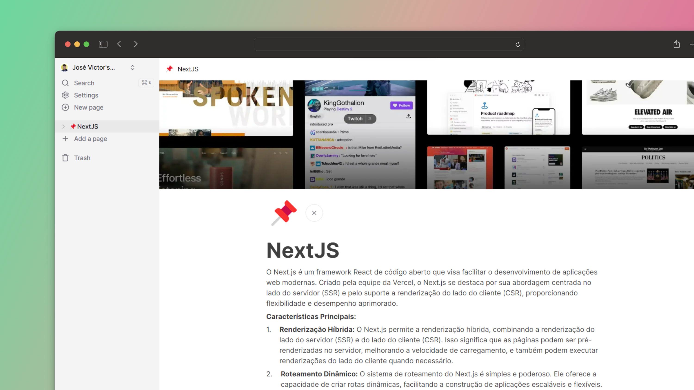

# Notion Clone

Um projeto fullstack inspirado no Notion, construído com Next.js 13, React, Convex e Tailwind. Esta aplicação oferece uma experiência completa, incluindo um editor estilo Notion, banco de dados em tempo real, modos claro e escuro, autenticação, upload e gerenciamento de arquivos, além de muitas outras funcionalidades. Totalmente responsivo para dispositivos móveis e com a capacidade de publicar suas notas na web. Perfeito para organizar suas ideias e colaborar em equipe.

## Funcionalidades

- Banco de dados em tempo real 🔗
- Editor estilo Notion 📝
- Modo claro e escuro 🌓
- Documentos infinitos e hierarquia de filhos 🌲
- Trash can & soft delete 🗑️
- Autenticação 🔐
- Upload de arquivos
- Exclusão de arquivos
- Substituição de arquivos
- Ícones para cada documento (alterações em tempo real) 🌠
- Sidebar expansível ➡️🔀⬅️
- Responsividade para dispositivos móveis 📱
- Landing page 🛬
- Imagem de capa para cada documento 🖼️
- Recuperação de arquivos excluídos 🔄📄

## Tecnologia utilizadas

- Next.js 13
- Typescript
- Convex
- TailwindCSS
- ShadcnUI
- Prisma
- Clerk
- Zod
- Zustand

## Execução do projeto

### Clone o repositório

```shell
git clone https://github.com/josevictorn/notion-clone.git
```

### Instale as dependências

```shell
npm i
```

### Configure o arquivo .env


```js
# Deployment used by `npx convex dev`
CONVEX_DEPLOYMENT=
NEXT_PUBLIC_CONVEX_URL=

NEXT_PUBLIC_CLERK_PUBLISHABLE_KEY=
CLERK_SECRET_KEY=

EDGE_STORE_ACCESS_KEY=
EDGE_STORE_SECRET_KEY=
```

### Configure o Convex

```shell
npx convex dev

```

### Start a aplicação

```shell
npm run dev
```

## Autor

Feito com amor por [@josevictorn](https://github.com/josevictorn)